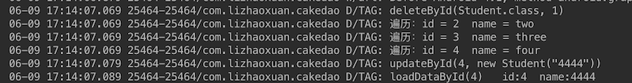

##Android编译时注解框架-数据库ORM框架CakeDao

 

《Android编译时注解框架-什么是编译时注解》

《Android编译时注解框架-Run Demo》

《Android编译时注解框架-Run Project：OnceClick》

《Android编译时注解框架-爬坑》

《Android编译时注解框架-语法讲解》

《Android编译时注解框架-数据库ORM框架CakeDao》

《Android编译时注解框架-APP更新回滚框架CakeRun》

《Android编译时注解框架-View绑定框架CakeKnife》

==============

###1.概述

采用一个ORM数据库框架来进行数据持久化操作几乎是现在所有APP的选择。那么最受欢迎的的ORM数据库框架有哪些呢？

GreenDao、OrmLite、Active Android 等等等等~

好吧，那么问题来了，既然已经有很多成熟的ORM数据库框架了，那我还在写一个有什么必要么？有的，简单分析一下上面的三个：

- OrmLite、Active Android:
	
	这两个框架异曲同工，虽然使用方式有差别，但都广泛的应用了注解来实现ORM操作。但你需要知道的是，这两个框架使用的**注解是运行时注解**，所以你懂得，反射提示了便利，但消耗了性能。
	
- GreenDao

	GreenDao的受欢迎程度不可置疑，因为它是目前速度最快的数据库框架了。它通过创建一个java Library来为我们的项目生成Dao类，直接调用代码，速度更快。但同样有一个被所有人呕病的问题，**过于奇怪的使用方法，需要较多的时间学习使用。**
	

缺点我们列出来了，性能问题和使用问题。难道就没有更好的办法兼容二者么？

有的，就是我们今天介绍的CakeDao。

###2.使用

CakeDao使用APT技术实现，**编译时注解 + 代码生成**。既有GreenDao的高效率，又有OrmLite的方便使用。看一下使用方式，超级简单，你一定会爱上它的。

#####依赖

Install with gradle

    dependencies {
        compile 'com.github.zhaoxuan:cake-dao:0.0.1'
    }

#####修饰实体类

在你要做数据持久化的实体类修饰CakeDao的注解。

CakeDao有两个注解：**@IdProperty和@DataProperty**

@IdProperty 修饰主键Id，**@IdProperty 必须被使用一次，类型必须为long。**

（这是CakeDao的唯一限制之处，因为初代版本，查询需要依赖主键ID，以后版本可能会去掉这个限制）
 
@DataProperty 用来修饰一般属性。

CakeDao支持的类型有：String,int,boolean,byte[],byte,java.util.Date,double,float,long.
类似GreenDao。

	public class Student {

    	@IdProperty
    	public long id;
    	@DataProperty
    	public String name;

    	public Student() {
    	}

    	public Student(String name) {
    	    this.name = name;
    	}
	}

#####初始化CakeDao

Context建议使用ApplicationContext。

	CakeDao.init(getApplicationContext(), DB_NAME, version, true);
	

init方法有两个重载：
	
	public static CakeDao init(Context context, String dbName, int version) 
	
	//ifTableIfNotExists ： 创建表时，是否添加IF NOT EXISTS关键字
	public static CakeDao init(Context context, String dbName, int version, boolean ifTableIfNotExists) 

	
	
	
#####使用

CakeDao有两种操作数据库的方法：

- 通过CakeDao静态方法：

	通过这种方法，需要在参数中传入对应Class

		CakeDao.insert(Student.class, new Student("one"));

- 取得对应Dao操作类：

	获取对应Dao操作类后，参数中可以不再传入对应Class

		AbstractCakeDao<Student> studentDao = CakeDao.getCakeDao(Student.class);
        studentDao.updateById(4, new Student("4444"));

下面是完整示例代码：

		CakeDao.insert(Student.class, new Student("one"));
        CakeDao.insert(Student.class, new Student("two"));
        CakeDao.insert(Student.class, new Student("three"));
        CakeDao.insert(Student.class, new Student("four"));

        CakeDao.deleteById(Student.class, 1);
        Log.d("TAG","deleteById(Student.class, 1)");

        Student[] students = CakeDao.loadAllData(Student.class);
        if (students != null) {
            for (Student student : students) {
                Log.d("TAG", "ergodic：id = " + student.id + "  name = " + student.name);
            }
        }

        AbstractCakeDao<Student> studentDao = CakeDao.getCakeDao(Student.class);
        studentDao.updateById(4, new Student("4444"));
        Log.d("TAG","updateById(4, new Student(\"4444\"))");
        Student student = studentDao.loadDataById(4)[0];
        Log.d("TAG", "loadDataById(4)   id:" + student.id + "  name:" + student.name);

日志输出：

**是不是超级简单！！！**

**是不是超级简单！！！**

**是不是超级简单！！！**

###3.半成品CakeDao

因为时间关系，当前版本的CakeDao是一个半成品，只有最基础的增删改查功能。不建议直接使用。

还有很多改进的地方，比如：增加事务、更完善的错误验证、效率优化、多样化的查询功能等等。

立个flag:预计7.1号可以完成。

