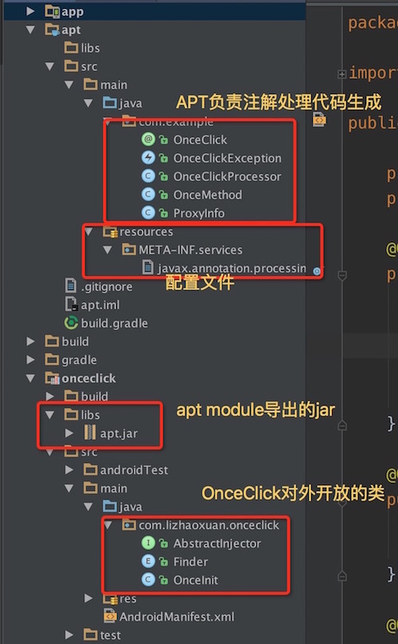
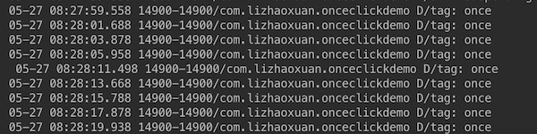
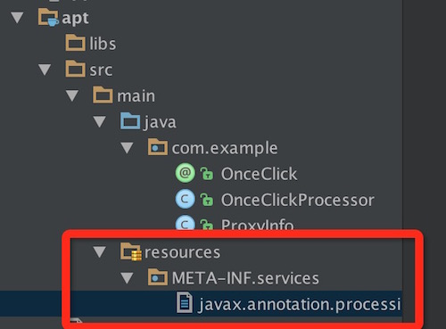

##Android编译时注解框架-Run Project

 

[《Android编译时注解框架-什么是编译时注解》](https://github.com/lizhaoxuan/Android-APT-Framework/blob/master/什么是编译时注解/android编译时注解框架-什么是编译时注解.md)

[《Android编译时注解框架-Run Demo》](https://github.com/lizhaoxuan/Android-APT-Framework/blob/master/run-demo/android编译时注解框架-run_demo.md)

《Android编译时注解框架-Run Project：OnceClick》

[《Android编译时注解框架-爬坑》](https://github.com/lizhaoxuan/Android-APT-Framework/blob/master/爬坑/android编译时注解框架-爬坑.md)

[《Android编译时注解框架-语法讲解》](https://github.com/lizhaoxuan/Android-APT-Framework/blob/master/语法讲解/android编译时注解框架-语法讲解.md)

[《Android编译时注解框架-数据库ORM框架CakeDao》](https://github.com/lizhaoxuan/Android-APT-Framework/blob/master/CakeDao/android编译时注解框架-数据库orm框架cakedao.md)

[《Android编译时注解框架-APP更新回滚框架CakeRun》](https://github.com/lizhaoxuan/Android-APT-Framework/blob/master/CakeRun/android编译时注解框架-hold_bug框架cakerun.md)

==============

###1.概述

因为编译时注解框架前期项目搭建部分需要较多的图文讲解，所以前一章《Android编译时注解框架-Run Demo》只是实现了最简单应用，或许注解信息，并没有生成代码。

本章将以生成代码为重点进行一个案例讲解。

#####框架名称：OnceClick

**框架功能：**功能就是它的名字：在一定时间内，按钮点击事件只能执行一次。未到指定时间，不执行点击事件。

**框架背景：**从用户的角度，在使用应用的过程中，因为低端机性能原因、Web页面性能问题，导致点击按钮后程序卡顿，按钮事件延迟执行。造成的后果就是，卡顿后，继续多次点击非常容易导致事件多次执行，造成不可预知的Bug，且影响用户体验。

**使用及项目引用地址：**[https://github.com/lizhaoxuan/OnceClick](https://github.com/lizhaoxuan/OnceClick)

OK，这是一个功能非常简单的小型类库。下面我们来实现它。

###2.项目搭建

具体的项目搭建细节前一章已经有了介绍，这里不再讲述。

**需要说明的是：**我们的目的是写一个Android库，APT Moudle是java Library，不能使用Android API。所以还需要创建一个Android Library，负责框架主体部分. 然后由Android Library引用APT jar包。

项目目录结构如图：

Module职责：

app：Demo

apt：java Library.负责代码生成。编译成apt-jar包供外部使用

onceclick：Android Library. OnceClick是我们真正对外发布并交由第三方使用的库，它引用了apt-jar包

###3.OnceClick使用

	public class MainActivity extends AppCompatActivity {

    	private TextView text;
    	private int num;

    	@Override
    	protected void onCreate(Bundle savedInstanceState) {
    	    super.onCreate(savedInstanceState);
    	    setContentView(R.layout.activity_main);
        	//类似于ButterKnife的Bind方法。初始化OnceClick
    	    OnceInit.once(this);
    	    text = (TextView)findViewById(R.id.textView);
    	}

    	@OnceClick(R.id.btn)
    	public void once(){
    	    text.setText("click"+num++);
    	    Log.d("tag","once");
    	}

    	@OnceClick(R.id.btn2)
    	public void onceMe(View v){
    	    ((Button)v).setText("click"+num++);
     	   Log.d("tag","onceMe");
    	}
	}
	
在我连续点击按钮的情况下，可以看到日志一定是要2秒以上才会执行点击事件。
	

###4.生成后代码

	// Generated code from OnceClick. Do not modify!
	package com.lizhaoxuan.onceclickdemo;

	import android.view.View;

	import com.lizhaoxuan.onceclick.Finder;
	import com.lizhaoxuan.onceclick.AbstractInjector;

	public class MainActivity$$PROXY<T extends MainActivity> implements AbstractInjector<T> {
		//间隔多久可以执行一次点击事件
    	public long intervalTime;

    	@Override
    	public void setIntervalTime(long time) {
    	    intervalTime = time;
    	}
		
    	@Override
    	public void inject(final Finder finder, final T target, Object source) {
        	View view;
        	view = finder.findViewById(source, 2131492945);
        	if (view != null) {
            	view.setOnClickListener(new View.OnClickListener() {
                	long time = 0L;
                	@Override
                	public void onClick(View v) {
                    	long temp = System.currentTimeMillis();
                    	if (temp - time >= intervalTime) {
                        	time = temp;
                        	target.once();
                    	}
                	}
            	});
        	}
	        view = finder.findViewById(source, 2131492946);
	        if (view != null) {
	            view.setOnClickListener(new View.OnClickListener() {
	                long time = 0L;
	                @Override
	                public void onClick(View v) {
	                    long temp = System.currentTimeMillis();
	                    if (temp - time >= intervalTime) {
	                        time = temp;
	                        target.onceMe(v);
		                    }
	                }
            	});
        	}
    	}
	}

这个就是自动生成的代码，生成代码的位置我们之前的篇章有讲过，代码也很简单，就不做过多解释了。

================

**OnceClick Module:**

###1.OnceInit.once

看到OnceClick的使用和生成后的代码你可能会有一点疑惑他们之间是如何联系在一起的。看下*OnceInit.java*一目了然，我在注释中做讲解:

	public class OnceInit {
    	private static final Map<Class<?>, AbstractInjector<Object>> INJECTORS = new LinkedHashMap<Class<?>, AbstractInjector<Object>>();

    	private static final long INTERVAL_TIME = 2000;

    	public static void once(Activity activity, long intervalTime) {
    		//生成的代码实现了AbstractInjector。我们通过activity找到生成的代码
    	    AbstractInjector<Object> injector = findInjector(activity);
    	    //执行生成代码中的inject方法
    	    //Finder是枚举，这里用Activity类型
    	    injector.inject(Finder.ACTIVITY, activity, activity);
    	    //设置间隔时间
    	    injector.setIntervalTime(intervalTime);
    	}
		
		//其他几个重载方法
    	public static void once(View view, long intervalTime) {
    	    AbstractInjector<Object> injector = findInjector(view);
    	    //Finder是枚举，这里用VIEW类型
        	injector.inject(Finder.VIEW, view, view);
        	injector.setIntervalTime(intervalTime);
    	}
    	public static void once(Activity activity) {
        	once(activity, INTERVAL_TIME);
    	}
    	public static void once(View view) {
        	once(view, INTERVAL_TIME);
    	}
		
		//查找生成的代码
    	private static AbstractInjector<Object> findInjector(Object activity) {
        	Class<?> clazz = activity.getClass();
        	//使用Map缓存一下，避免重复查找
        	AbstractInjector<Object> injector = INJECTORS.get(clazz);
        	if (injector == null) {
            	try {
            		//生成代码的类名是有格式的，className$$PROXY.所以我们可以通过字符串找到类，并初始化它。
                	Class injectorClazz = Class.forName(clazz.getName() + "$$"
                        + ProxyInfo.PROXY);
                	injector = (AbstractInjector<Object>) injectorClazz
                        .newInstance();
                	INJECTORS.put(clazz, injector);
            	} catch (Exception e) {
                	e.printStackTrace();
            	}
        	}
        	return injector;
    	}
	}

###2.AbstractInjector
代理类接口，所有生成代码类都要实现这个接口。

inject方法用于实现代理代码。

setIntervalTime设置点击事件执行间隔时间。

	public interface AbstractInjector<T> {

    	void inject(Finder finder, T target, Object source);
	
    	void setIntervalTime(long time);
	}

###3.Finder

Finder的作用是根据不同的类型，去实现不同的findViewById方法。

	public enum Finder {
    	VIEW {
        	@Override
        	public View findViewById(Object source, int id) {
            	return ((View) source).findViewById(id);
        	}
    	},
    	ACTIVITY {
        	@Override
        	public View findViewById(Object source, int id) {
            	return ((Activity) source).findViewById(id);
        	}
    	};
    	public abstract View findViewById(Object source, int id);
	}

================

**APT MODULE：**

###1.自定义注解

	@Retention(RetentionPolicy.CLASS)
	@Target(ElementType.METHOD)
	public @interface OnceClick {

    	int value();
	}

OnceClick只有一个默认参数，用来设置View的Id。

###2.配置文件

编写文件javax.annotation.processing.Processor。

	com.example.OnceClickProcessor
	

###3.Process类-getSupportedAnnotationTypes

	@Override
    public Set<String> getSupportedAnnotationTypes() {
        Set<String> types = new LinkedHashSet<>();
        types.add(OnceClick.class.getCanonicalName());
        return types;
    }
    

###4.Process类-process方法

重点来啦。这里需要讲一个概念。

当某个类Activity使用了@OnceClick注解之后，我们就应该为其生成一个对应的代理类，代理类实现我们框架的功能：为某个View设置点击事件，并且这个点击事件一定时间内只能执行一次。

所以，一个代理类可能有多个需要处理的View。

先看process代码：

	@Override
	public boolean process(Set<? extends TypeElement> annotations, RoundEnvironment roundEnv) {
        //获取proxyMap
        Map<String, ProxyInfo> proxyMap = getProxyMap(roundEnv);
        //遍历proxyMap，并生成代码
        for (String key : proxyMap.keySet()) {
            ProxyInfo proxyInfo = proxyMap.get(key);
            writeCode(proxyInfo);
        }
        return true;
    }

**ProxyInfo对象**：存放生成代理类的必要信息，并生成代码。

**getProxyMap方法**：使用参数roundEnv，遍历所有@OnceClick注解，并生成代理类ProxyInfo的Map。

**writeCode方法**：真正生成代码的方法。

总结一下：编译时，取得所有需要生成的代理类信息。遍历代理类集合，根据代理类信息，生成代码。

###5.ProxyInfo代理类

其实这个类，才是这个框架的重中之重，因为生成什么代码，全靠这个类说了算。这个类也没什么好讲的，就是用StringBuidler拼出一个类来。ProxyInfo保存的是类信息，方法信息我们用List<OnceMethod> methods保存。**然后根据这些信息生成类。**

	public class ProxyInfo {
	    private String packageName;
	    private String targetClassName;
	    private String proxyClassName;
	    private TypeElement typeElement;

	    private List<OnceMethod> methods;

	    public static final String PROXY = "PROXY";

	    ProxyInfo(String packageName, String className) {
	        this.packageName = packageName;
	        this.targetClassName = className;
	        this.proxyClassName = className + "$$" + PROXY;
	    }

	    String getProxyClassFullName() {
	        return packageName + "." + proxyClassName;
	    }

	    String generateJavaCode() throws OnceClickException {

	        StringBuilder builder = new StringBuilder();
	        builder.append("// Generated code from OnceClick. Do not modify!\n");
	        builder.append("package ").append(packageName).append(";\n\n");

	        builder.append("import android.view.View;\n");
	        builder.append("import com.lizhaoxuan.onceclick.Finder;\n");
	        builder.append("import com.lizhaoxuan.onceclick.AbstractInjector;\n");
	        builder.append('\n');

	        builder.append("public class ").append(proxyClassName);
	        builder.append("<T extends ").append(getTargetClassName()).append(">");
	        builder.append(" implements AbstractInjector<T>");
	        builder.append(" {\n");

	        generateInjectMethod(builder);
	        builder.append('\n');

	        builder.append("}\n");
	        return builder.toString();

	    }

	    private String getTargetClassName() {
	        return targetClassName.replace("$", ".");
	    }

	    private void generateInjectMethod(StringBuilder builder) throws OnceClickException {

	        builder.append("public long intervalTime; \n");

	        builder.append("  @Override ")
	                .append("public void setIntervalTime(long time) {\n")
	                .append("intervalTime = time;\n     } \n");
	        builder.append("  @Override ")
	                .append("public void inject(final Finder finder, final T target, Object source) {\n");
	        builder.append("View view;");

	        for (OnceMethod method : getMethods()) {
	            builder.append("    view = ")
	                    .append("finder.findViewById(source, ")
	                    .append(method.getId())
	                    .append(");\n");
	            builder.append("if(view != null){")
	                    .append("view.setOnClickListener(new View.OnClickListener() {\n")
	                    .append("long time = 0L;");
	            builder.append("@Override\n")
	                    .append("public void onClick(View v) {");
	            builder.append("long temp = System.currentTimeMillis();\n")
	                    .append("if (temp - time >= intervalTime) {\n" +
	                            	"time = temp;\n");
            	if (method.getMethodParametersSize() == 1) {
                	if (method.getMethodParameters().get(0).equals("android.view.View")) {
                    	builder.append("target.").append(method.getMethodName()).append("(v);");
                	} else {
                    	throw new OnceClickException("Parameters must be android.view.View");
                	}
            	} else if (method.getMethodParametersSize() == 0) {
                builder.append("target.").append(method.getMethodName()).append("();");
            	} else {
                	throw new OnceClickException("Does not support more than one parameter");
            	}
            	builder.append("\n}")
            	        .append("    }\n")
            	        .append("        });\n}");
        	}

        	builder.append("  }\n");
    	}

    	TypeElement getTypeElement() {
    	    return typeElement;
    	}

    	void setTypeElement(TypeElement typeElement) {
    	    this.typeElement = typeElement;
    	}

    	List<OnceMethod> getMethods() {
    	    return methods == null ? new ArrayList<OnceMethod>() : methods;
    	}

    	void addMethod(OnceMethod onceMethod) {
        	if (methods == null) {
            	methods = new ArrayList<>();
        	}
        	methods.add(onceMethod);
    	}
	}

###6.OnceMethod类

需要讲的一点是，每一个使用了@OnceClick注解的Activity或View，都会为其生成一个代理类，而一个代理中有可能有很多个@OnceClick修饰的方法，所以我们专门为每个方法有创建了一个javaBean用于保存方法信息:

	public class OnceMethod {
    
        private int id;
        private String methodName;
        private List<String> methodParameters;
    
        OnceMethod(int id, String methodName, List<String> methodParameters) {
            this.id = id;
            this.methodName = methodName;
            this.methodParameters = methodParameters;
        }
    
        int getMethodParametersSize() {
            return methodParameters == null ? 0 : methodParameters.size();
        }
    
        int getId() {
            return id;
        }
    
        String getMethodName() {
            return methodName;
        }
    
        List<String> getMethodParameters() {
            return methodParameters;
        }
    
    }

###7.getProxyMap方法

getProxyMap其实也很简单的。通过注释就可以理解。

比较不容易理解的是TypeElement、PackageElement的处理。这方面语法还请看《Android编译时注解框架-语法讲解》。

	private Map<String, ProxyInfo> getProxyMap( RoundEnvironment roundEnv){
        Map<String, ProxyInfo> proxyMap = new HashMap<>();
        //遍历项目中所有的@OnceClick注解
        for (Element element : roundEnv.getElementsAnnotatedWith(OnceClick.class)) {			
        	//获取基本的类名、包名
            TypeElement classElement = (TypeElement) element;
            PackageElement packageElement = (PackageElement) element
                    .getEnclosingElement();

            String fullClassName = classElement.getQualifiedName().toString();
            String className = classElement.getSimpleName().toString();
            String packageName = packageElement.getQualifiedName().toString();
            //获取注解参数
            int viewId = classElement.getAnnotation(OnceClick.class).value();

            ProxyInfo proxyInfo = proxyMap.get(fullClassName);
            //如果以创建该代理类，就只add viewId
            if (proxyInfo != null) {
                proxyInfo.addLayoutId(viewId);
            } else {
                proxyInfo = new ProxyInfo(packageName, className);
                proxyInfo.setTypeElement(classElement);
                proxyInfo.addLayoutId(viewId);
                proxyMap.put(fullClassName, proxyInfo);
            }
        }
        return proxyMap;
    }

###8.writeCode方法

writeCode方法用来生成代码文件，这个方法的代码相对固定，基本不用该，就是这样的。

需要注意的是 *writer.write(proxyInfo.generateJavaCode());*。需要生成的代码以字符串形式传给writer。

	private void writeCode(ProxyInfo proxyInfo){
        try {
            JavaFileObject jfo = processingEnv.getFiler().createSourceFile(
                    proxyInfo.getProxyClassFullName(),
                    proxyInfo.getTypeElement());
            Writer writer = jfo.openWriter();
            writer.write(proxyInfo.generateJavaCode());
            writer.flush();
            writer.close();
        } catch (IOException e) {
            error(proxyInfo.getTypeElement(),
                    "Unable to write injector for type %s: %s",
                    proxyInfo.getTypeElement(), e.getMessage());
        }
    }
    
    //两个日志输出方法。
    private void print(String message){
        messager.printMessage(Diagnostic.Kind.NOTE, message);
    }

    private void error(Element element, String message, Object... args) {
        if (args.length > 0) {
            message = String.format(message, args);
        }
        messager.printMessage(Diagnostic.Kind.ERROR, message, element);
    }

