##Android编译时注解框架-什么是编译时注解

 

《Android编译时注解框架-什么是编译时注解》

[《Android编译时注解框架-Run Demo》](https://github.com/lizhaoxuan/Android-APT-Framework/blob/master/run-demo/android编译时注解框架-run_demo.md)

[《Android编译时注解框架-Run Project：OnceClick》](https://github.com/lizhaoxuan/Android-APT-Framework/blob/master/run-project/android编译时注解框架-run_project.md)

[《Android编译时注解框架-爬坑》](https://github.com/lizhaoxuan/Android-APT-Framework/blob/master/爬坑/android编译时注解框架-爬坑.md)

[《Android编译时注解框架-语法讲解》](https://github.com/lizhaoxuan/Android-APT-Framework/blob/master/语法讲解/android编译时注解框架-语法讲解.md)

[《Android编译时注解框架-数据库ORM框架CakeDao》](https://github.com/lizhaoxuan/Android-APT-Framework/blob/master/CakeDao/android编译时注解框架-数据库orm框架cakedao.md)

[《Android编译时注解框架-APP更新回滚框架CakeRun》](https://github.com/lizhaoxuan/Android-APT-Framework/blob/master/CakeRun/android编译时注解框架-hold_bug框架cakerun.md)

==============

###1.概述

提到注解，普遍都会有两种态度：黑科技、低性能。使用注解往往可以实现用非常少的代码作出匪夷所思的事情，比如这些框架：ButterKnife、Retrofit。但一直被人呕病的是，运行时注解会因为java反射而引起较为严重的性能问题。

今天我们要讲的是，不会对性能有任何影响的黑科技：**编译时注解**。也有人叫它**代码生成**，其实他们还是有些区别的，在编译时对注解做处理，通过注解，获取必要信息，在项目中生成代码，运行时调用，和直接运行手写代码没有任何区别。而更准确的叫法：APT - Annotation Processing Tool

得当的使用编译时注解，可以极大的提高开发效率，避免编写重复、易错的代码。大部分时候编译时注解都可以代替java反射，利用可以直接调用的代码代替反射，极大的提升运行效率。

本章作为《Android编译时注解框架》系列的第一章，将分三个部分让你简单认识注解框架。之后我们会一步步的创建属于自己的编译时注解框架。

- 什么是注解

- 运行时注解的简单使用

- 编译时注解框架ButterKnife源码初探

###2.什么是注解

注解你一定不会陌生，这就是我们最常见的注解：

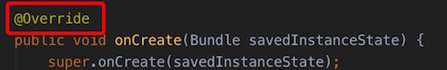

首先注解分为三类，：

- 标准 Annotation

	包括 Override, Deprecated, SuppressWarnings，是java自带的几个注解，他们由编译器来识别，不会进行编译，
	不影响代码运行，至于他们的含义不是这篇博客的重点，这里不再讲述。

- 元 Annotation

	@Retention, @Target, @Inherited, @Documented，它们是用来定义 Annotation 的 Annotation。也就是当我们要自定义注解时，需要使用它们。
	
- 自定义 Annotation
	
	根据需要，自定义的Annotation。而自定义的方式，下面我们会讲到。
	

同样，自定义的注解也分为三类，通过元Annotation - @Retention 定义：

- @Retention(RetentionPolicy.SOURCE)

	源码时注解，一般用来作为编译器标记。如Override, Deprecated, SuppressWarnings。
	
- @Retention(RetentionPolicy.RUNTIME)

	运行时注解，在运行时通过反射去识别的注解。

- @Retention(RetentionPolicy.CLASS)

	编译时注解，在编译时被识别并处理的注解，这是本章重点。

###3.运行时注解的简单使用

运行时注解的实质是，在代码中通过注解进行标记，运行时通过反射寻找标记进行某种处理。而运行时注解一直以来被呕病的原因便是反射的低效。

下面展示一个Demo。其功能是通过注解实现布局文件的设置。

之前我们是这样设置布局文件的：

	@Override
    protected void onCreate(Bundle savedInstanceState) {
        super.onCreate(savedInstanceState);
        setContentView(R.layout.activity_home);
    }
    
如果使用注解，我们就可以这样设置布局了

	@ContentView(R.layout.activity_home)
	public class HomeActivity extends BaseActivity {
		。。。
	}
	
我们先不讲这两种方式哪个好哪个坏，我们只谈技术不谈需求。

那么这样的注解是怎么实现的呢？很简单，往下看。

#####3.1创建一个注解
	
	@Retention(RetentionPolicy.RUNTIME)
	@Target({ElementType.TYPE})
	public @interface ContentView {
    	int value();
	}

**第一行:@Retention(RetentionPolicy.RUNTIME)**

@Retention用来修饰这是一个什么类型的注解。这里表示该注解是一个运行时注解。这样APT就知道啥时候处理这个注解了。

**第二行：@Target({ElementType.TYPE})**

@Target用来表示这个注解可以使用在哪些地方。比如：类、方法、属性、接口等等。这里ElementType.TYPE 表示这个注解可以用来修饰：Class, interface or enum declaration。当你用ContentView修饰一个方法时，编译器会提示错误。

**第三行：public @interface ContentView**

这里的interface并不是说ContentView是一个接口。就像申明类用关键字class。申明枚举用enum。申明注解用的就是@interface。（值得注意的是：在ElementType的分类中，class、interface、Annotation、enum同属一类为Type，并且从官方注解来看，似乎interface是包含@interface的）

	/** Class, interface (including annotation type), or enum declaration */
	TYPE,

**第四行：int value();**

返回值表示这个注解里可以存放什么类型值。比如我们是这样使用的

	@ContentView(R.layout.activity_home)
	
R.layout.activity_home实质是一个int型id，如果这样用就会报错：

	@ContentView(“string”)
	

**关于注解的具体语法，这篇不在详述，统一放到《Android编译时注解框架-语法讲解》中**

#####3.2 注解解析

注解申明好了，但具体是怎么识别这个注解并使用的呢？

	@ContentView(R.layout.activity_home)
	public class HomeActivity extends BaseActivity {
		。。。
	}

注解的解析就在BaseActivity中。我们看一下BaseActivity代码

	public class BaseActivity extends AppCompatActivity {
	
		@Override
    	protected void onCreate(Bundle savedInstanceState) {
        super.onCreate(savedInstanceState);
        //注解解析
		for (Class c = this.getClass(); c != Context.class; c = c.getSuperclass()) {
            ContentView annotation = (ContentView) c.getAnnotation(ContentView.class);
            if (annotation != null) {
                try {
                    this.setContentView(annotation.value());
                } catch (RuntimeException e) {
                    e.printStackTrace();
                }
                return;
            }
        }
	}

	
第一步：遍历所有的子类

第二步：找到修饰了注解ContentView的类

第三步：获取ContentView的属性值。

第四步：为Activity设置布局。

#####3.3 总结

相信你现在对运行时注解的使用一定有了一些理解了。也知道了运行时注解被人呕病的地方在哪了。

你可能会觉得*setContentView(R.layout.activity_home)*和*@ContentView(R.layout.activity_home)*没什么区别，用了注解反而还增加了性能问题。

但你要知道，这只是注解最简单的应用方式。举一个例子：AndroidEventBus的注解是运行时注解，虽然会有一点性能问题，但是在开发效率上是有提高的。

因为这篇博客的重点不是运行时注解，所以我们不对其源码进行解析。有兴趣的可以去github搜一下看看哦~话说AndroidEventBus还是我一个学长写得，haha~。

###4.编译时注解框架ButterKnife源码初探

ButterKnife大家应该都很熟悉的吧，9000多颗start，让我们彻底告别了枯燥的findViewbyId。它的使用方式是这样的：

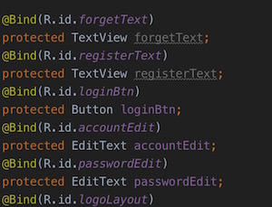

你难道就没有好奇过，它是怎么实现的吗？嘿嘿，这就是编译时注解-代码生成的黑科技所在了。

秘密在这里，编译工程后，打开你的项目app目录下的build目录：

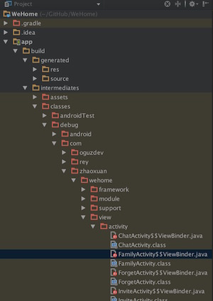

你可以看到一些带有*$$ViewBinder*后缀的类文件。这个就是ButterKnife生成的代码我们打开它：

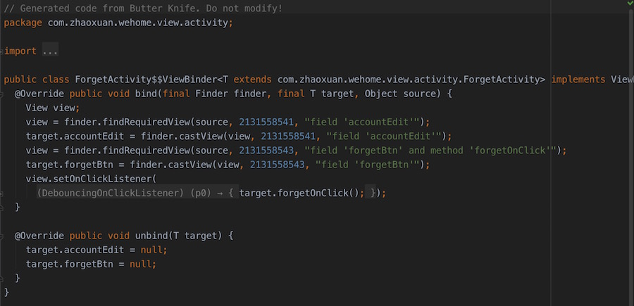

上面有一条注释：
// Generated code from Butter Knife. Do not modify!

1.ForgetActivity$$ViewBinder 和 我们的 ForgetActivity同在一个包下：

	package com.zhaoxuan.wehome.view.activity;
	
同在一个包下的意义是什么呢？ForgetActivity$$ViewBinder 可以直接使用 ForgetActivity protected级别以上的属性方法。就像这样：

		//accountEdit是ForgetActivity当中定义的控件
	    target.accountEdit = finder.castView(view, 2131558541, "field 'accountEdit'");

所以你也应该知道了为什么当使用private时会报错了吧？

2.我们不去管细节，只是大概看一下这段生成的代码是什么意思。我把解析写在注释里。

	@Override
    public void bind(final Finder finder, final T target, Object source) {
        //定义了一个View对象引用，这个对象引用被重复使用了（这可是一个偷懒的写法哦~）
        View view;
        
        //暂时不管Finder是个什么东西，反正就是一种类似于findViewById的操作。
        view = finder.findRequiredView(source, 2131558541, "field 'accountEdit'");
        
        //target就是我们的ForgetActivity，为ForgetActivity中的accountEdit赋值
        target.accountEdit = finder.castView(view, 2131558541, "field 'accountEdit'");
        
        view = finder.findRequiredView(source, 2131558543, "field 'forgetBtn' and method 'forgetOnClick'");
        target.forgetBtn = finder.castView(view, 2131558543, "field 'forgetBtn'");
        
        //给view设置一个点击事件
        view.setOnClickListener(
                new butterknife.internal.DebouncingOnClickListener() {
                    @Override
                    public void doClick(android.view.View p0) {
                    
                    	//forgetOnClick()就是我们在ForgetActivity中写得事件方法。
                       target.forgetOnClick();
                       
                    }
                });
    }

OK，现在你大致明白了ButterKnife的秘密了吧？通过自动生成代码的方式来代替我们去写findViewById这样繁琐的代码。现在你一定在疑惑两个问题：

1.这个bind方法什么时候被调用？我们的代码里并没有ForgetActivity$$ViewBinder 这种奇怪的类引用呀。

2.Finder到底是个什么东西？凭什么它可以找到view。

不着急不着急，慢慢看。
#####4.1 注解: @Bind的定义

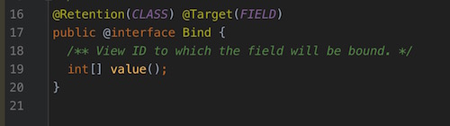

我们可以解读的信息如下：

1.Bind是编译时注解

2.只能修饰属性

3.属性值是一个int型的数组。

创建好自定义注解，之后我们就可以通过APT去识别解析到这些注解，并且可以通过这些注解得到注解的值、注解所修饰的类的类型、名称。注解所在类的名称等等信息。

#####4.2 Finder类

通过上面生成的代码，你一定奇怪，Finder到底是个什么东西。Finder实际是一个枚举。

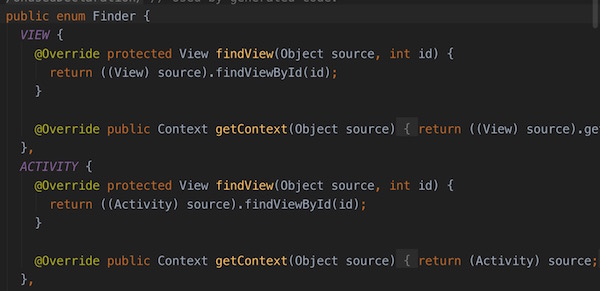

根据不同类型的，提供了不同实现的findView和getContext方法。这里你终于看到了熟悉的findViewById了吧，哈哈，秘密就在这里。

另外Finder还有两个重要的方法，也是刚才没有介绍清楚的： *finder.findRequiredView* 和 *finder.castView*

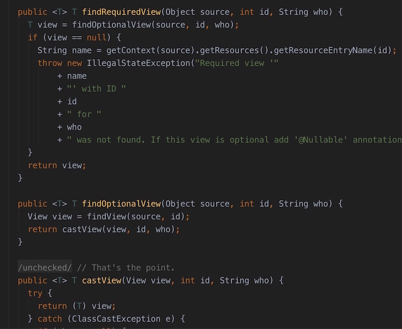

findRequiredView 方法调用了 findOptionalView 方法

findOptionalView调用了不同枚举类实现的findView方法（实际上就是findViewById啦~）

findView取得view后，又交给了castView做一些容错处理。

castView上来啥都不干直接强转并return。如果发生异常，就执行catch方法，只是抛出异常而已，我们就不看了。

#####4.3 ButterKnife.bind(this)方法

*ButterKnife.bind(this)*这个方法我们通常都在BaseActivity的onCreate方法中调用，似乎所有的findViewById方法，都被这一个bind方法化解了~

bind有几个重载方法，但最终调的都是下面这个方法。

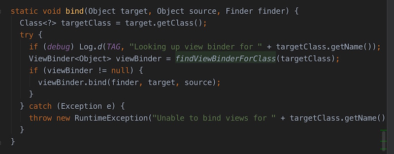

参数target一般是我们的Activity，source是用来获取Context查找资源的。当target是activity时，Finder是Finder.ACTIVITY。

首先取得target，（也就是Activity）的Class对象，根据Class对象找到生成的类，例如：*ForgetActivity$$ViewBinder*。

然后调用ForgetActivity$$ViewBinder的bind方法。

然后就没有啦~看到这里你就大致明白了在程序运行过程中ButterKnife的实现原理了。下面上重头戏，ButterKnife编译时所做的工作。

#####4.4 ButterKnifeProcessor

你可能在疑惑，ButterKnife是如何识别注解的，又是如何生成代码的。

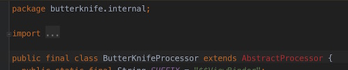

AbstractProcessor是APT的核心类，所有的黑科技，都产生在这里。AbstractProcessor只有两个最重要的方法process 和 getSupportedAnnotationTypes。

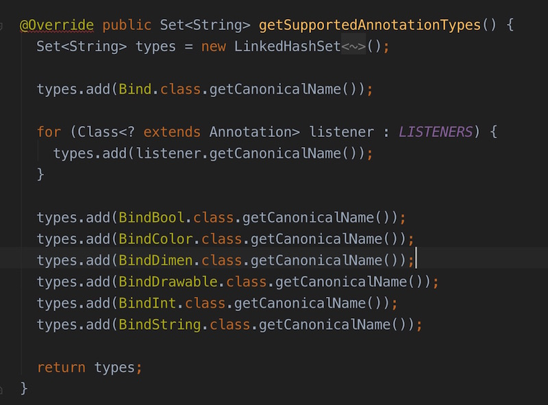

重写getSupportedAnnotationTypes方法，用来表示该AbstractProcessor类处理哪些注解。

第一个最明显的就是Bind注解啦。

而所有的注解处理，都是在process中执行的：

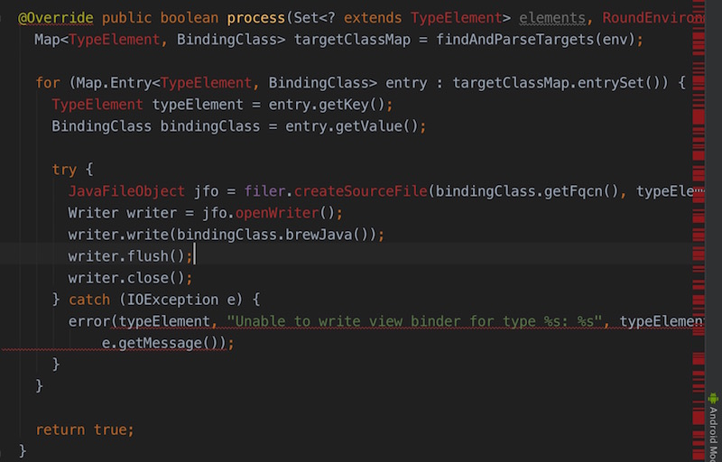

通过findAndParseTargets方法拿到所有需要被处理的注解集合。然后对其进行遍历。

JavaFileObject是我们代码生成的关键对象，它的作用是写java文件。ForgetActivity$$ViewBinder这种奇怪的类文件，就是用JavaFileObject来生成的。

这里我们只关注最重要的一句话

	writer.write(bindingClass.brewJava());
	
ForgetActivity$$ViewBinder中所有代码，都是通过bindingClass.brewJava方法拼出来的。

#####4.5 bindingClass.brewJava方法

哎，我不知道你看到这个代码时候，是什么感觉。反正我看到这个时候脑袋里只有一句话：好low啊……

我根本没想到这么黑科技高大上的东西居然是这么写出来的。一行代码一行代码往出拼啊……

既然知道是字符串拼接起来的，就没有看下去的心思了，这里就不放完整代码了。

由此，你也知道了之前看生成的代码，为什么是用了偷懒的方法写了吧~

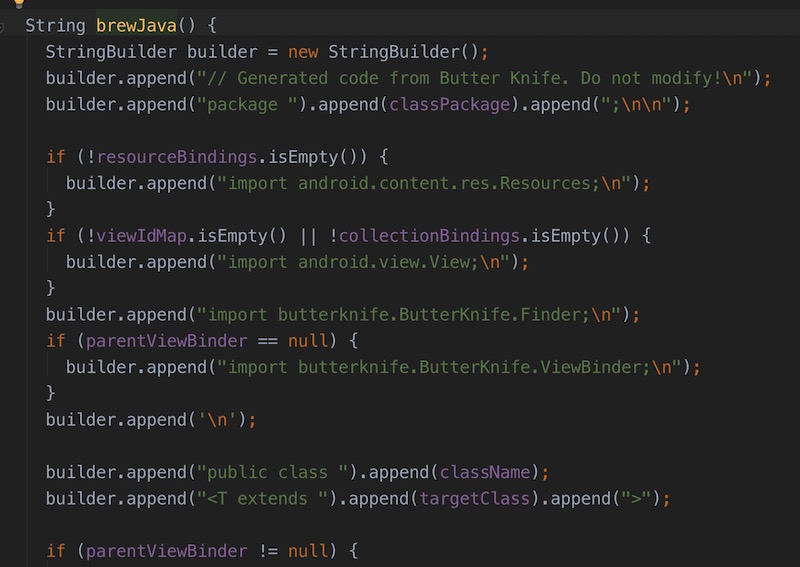

###总结

当你揭开一个不熟悉领域的面纱后，黑科技好像也不过如此，甚至用字符串拼接出来的代码感觉lowlow的。

但这不正是学习的魅力么？

好了，总结一下。

1.编译时注解的魅力在于：编译时按照一定侧率生成代码，避免编写重复代码，提高开发效率，且不影响性能。

2.代码生成与代码插入（Aspectj）是有区别的。代码插入面向切面，是在代码运行前后插入代码，新产生的代码是由原有代码触发的。而代码生成只是自动产生一套独立的代码，代码的执行还是需要主动调用才可以。

3.APT是一套非常强大的机制，它唯一的限制在于你天马行空的设计~

4.ButterKnife的原理其实很简单，可是为什么这么简单的功能，却写了那么多代码呢？因为ButterKnife作为一个外部依赖框架，做了大量的容错和效验来保证运行稳定。所以：**写一个框架最难的不是技术实现，而是稳定！**

5.ButterKnife有一个非常值得借鉴的地方，就是如何用生成的代码对已有的代码进行代理执行。这个如果你在研究有代理功能的APT框架的话，应该好好研究一下。

APT就好像一块蛋糕摆在你面前，就看你如何优雅的吃了。

后续篇章我将会陆续推出几款以Cake命名的APT框架。

