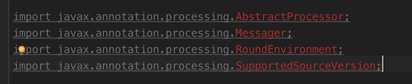
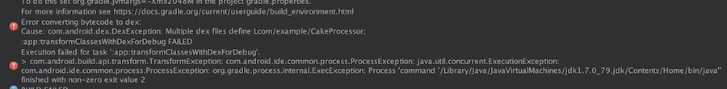

##Android编译时注解框架-爬坑

 

《Android编译时注解框架-什么是编译时注解》

《Android编译时注解框架-Run Demo》

《Android编译时注解框架-Run Project：OnceClick》

《Android编译时注解框架-爬坑》

《Android编译时注解框架-语法讲解》

《Android编译时注解框架-数据库ORM框架CakeDao》

《Android编译时注解框架-APP更新回滚框架CakeRun》

《Android编译时注解框架-事件分发框架CakeBus》

《Android编译时注解框架-View绑定框架CakeKnife》

==============

###概述

因为有关APT的资料过少，又因为是Java Moudle +Android Moudle的使用方式，在项目编写过程中，会有一些匪夷所思的奇怪问题~入门阶段真的是步履维艰。

这篇博客就是编写《Android编译时注解框架》系列中，将所遇到的一些坑列举出来，并给出一些绕过坑的方法。（注意哦~是绕过，坑还在，没有填~因为不知道这坑咋来的……）

随时踩坑，随时更新~

###坑1：无法引入javax包下的类库

编写编译时注解框架时，需要用到javax包下的一些类库，但是引入包时却提示没有。

#####解决：javax包属于java,Android核心库中没有。所以不能直接在app Module和Android Library中使用，必须要创建一个Java Library。然后由Java Library导出jar包使用。

==============

###坑2：Build通过，编译失败

报错信息： **finished with non-zero exit value 2**

	Error:Execution failed for task ':app:transformClassesWithDexForDebug'.
	> com.android.build.api.transform.TransformException: com.android.ide.common.process.ProcessException: java.util.concurrent.ExecutionException: com.android.ide.common.process.ProcessException: org.gradle.process.internal.ExecException: Process 'command '/Library/Java/JavaVirtualMachines/jdk1.7.0_79.jdk/Contents/Home/bin/java'' finished with non-zero exit value 2

	
这个问题引起了很大程度的误解，因为是看错误信息是jdk的错误，关注点一直放到了jdk版本上。

开始换了jdk版本为1.8。成功运行了一次，但是之后修改代码又报错了。

#####解决： app Moudle不能直接引用 apt Module（编写注解处理代码的Module），需要apt Module导出jar包，app Moudle引入jar包才可以。

==============

###坑3：只能成功运行一次，修改代码后再运行就报错

报错内容同 **坑2**相同。

app Moudle直接引用 apt Module 可以成功运行一次，但再次修改apt Module代码后，运行就会报错，代码再修改回来，就又可以运行了。（就好像一次性项目一样……）

#####解决： app Moudle不能直接引用 apt Module（编写注解处理代码的Module），需要apt Module导出jar包，app Moudle引入jar包才可以。

==============

###坑4：错误: javax.annotation.processing.Processor: Error reading configuration file时抛出异常错误

错误提示：

	错误: 服务配置文件不正确, 或构造处理程序对象javax.annotation.processing.Processor: Error reading configuration file时抛出异常错误

#####解决： app Moudle不能直接引用 apt Module（编写注解处理代码的Module），需要apt Module导出jar包，app Moudle引入jar包才可以。

==============

###坑5：成功运行，没有任何报错，但也没有任何预期结果。

这是比较容易忽视的两个问题。

#####Check 1:检查是否添加了配置文件：*javax.annotation.processing.Processor*

（添加方式请看 前一篇 《Android编译时注解框架-Run Demo》）

#####Check 2:检查是否重写了*getSupportedAnnotationTypes*方法：*javax.annotation.processing.Processor*

重写该方法告诉*Processor*它需要处理哪些注解。
	
==============
	
###坑6：替换APT jar包后，apt代码并没有被执行。

#####解决： 尝试 clean项目 ，并重新编译。
	
==============
	
	
	
	
	